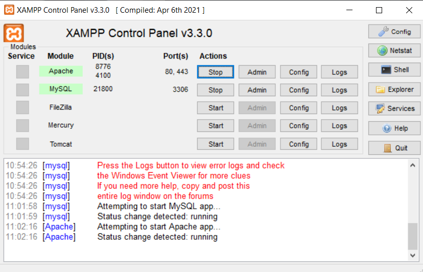
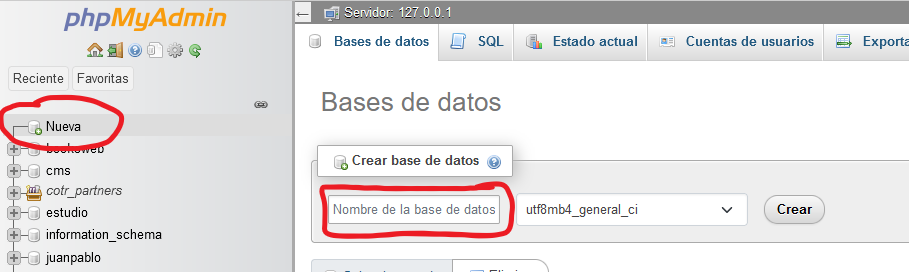

# Wagtail
## _Landing page creada con wagtail (prototipo)_

En esta documentacion se explica como clonar y levantar el proyecto local

Debemos tener instalados:
- Git
- Xampp
- Python

## Pasos

* Creamos una carpeta donde vamos a colocar el proyecto
* En la terminal que elijamos (ej: terminal de windows)  nos paramos sobre la ruta de la carpeta con cd <ruta>, ej: 
```cd C:\Users\jchoternasty_the-8ag\Desktop\pruebas\Landing``` 
* Vamos a crear un entorno virtual para instalar las dependencias de nuestro proyeto, ejecutamos: 
```python -m venv <nombre entorno>```
* Una vez creado el entorno lo vamos a activar: 
```.\<nombre entorno>\Scripts\activate```
* Nos deberia aparecer entre () el nombre del entorno

> C:\Users\jchoternasty_the-8ag\Desktop\pruebas\Landing\cms-wagtail-base(master -> origin)
> (`<nombre entorno>`) λ

* Vamos a clonar el repositorio con la app: 
```git clone https://github.com/juanpabloch/wagtail-landing.git```

* Cuando termine el proceso entramos en la carpeta creada: ```cd cms-wagtail-base```
* Vamos a instalar las dependencias de la app (puede tardar un poco dependiando de la coneccion a internet):  
```pip install -r requirements.txt```
* Abrimos xampp y apretamos strat en MySQL y Apache



* Ahora en el browser vamos a: http://localhost/phpmyadmin/index.php
y vamos a crear una tabla: 
click en nueva, y despues colocamos el nombre de la tabla: `landing`, y apretamos crear



* debemos cambiar el nombre del archivo `.env.sample` (que esta en la raiz de la app) a `.env` este contiene las configuraciones para conectarse a la base de datos local 

* Debemos crear las tablas para que funcione la app, volvemos a la terminal y ejecutamos: 
	- ```python manage.py makemigrations```
	- ```python manage.py migrate```

* vamos a crear un usuario para poder ingresar al admin de wagtail: 
```python manage.py createsuperuser```

> username:
> email: 
> password: 
> repetir password:

* Ahora podemos ejecutar el programa: `python manage.py runserver`
    * y en el browser podemos ver la pagina: http://127.0.0.1:8080/
    * y si queremos ver el admin: http://127.0.0.1:8080/admin
